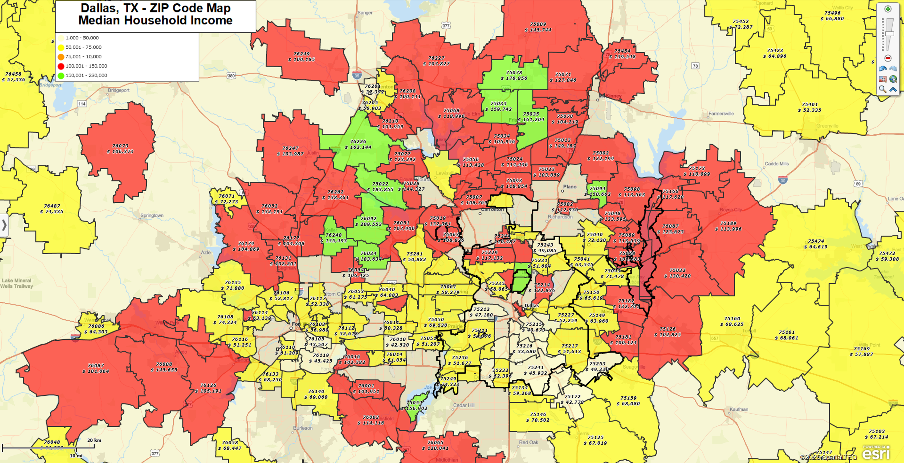

# IDX Real Estate Market Analysis

  

This project was created during my IDX Exchange real estate data internship. I used Python, Pandas, Tableau, and GitHub Pages to analyze MLS real estate listing data and create market dashboards.

---

## Project Overview

The goal of this project was to clean and analyze MLS listing data to understand housing market trends such as home prices, days on market, property types, and city-level activity.

---

## Tools Used

- Python
- Pandas
- Tableau
- GitHub Pages
- MLS / CRMLS datasets

---

## Skills Practiced

- Data cleaning
- Exploratory Data Analysis
- Dashboard creation
- Real estate market analysis
- Data visualization

---

## Purpose

This repository showcases my real estate data analysis work from my IDX Exchange internship.
